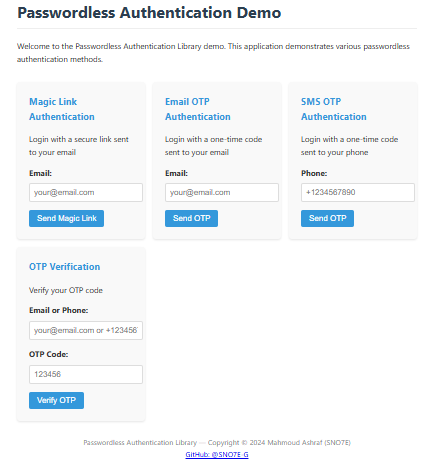

# Passwordless Authentication Library

<div align="center">
  <h3>Secure, Seamless Authentication without Passwords</h3>

  [](https://github.com/SNO7E-G)
  [](LICENSE)
  [](https://www.typescriptlang.org/)
  [](https://nodejs.org/)
  [](https://github.com/SNO7E-G)
</div>

<p align="center">
  <a href="#overview">Overview</a> •
  <a href="#features">Features</a> •
  <a href="#demo">Demo</a> •
  <a href="#quick-start">Quick Start</a> •
  <a href="#documentation">Documentation</a> •
  <a href="#security">Security</a> •
  <a href="#license">License</a>
</p>

<p align="center">
  
</p>

## 📋 Overview

The Passwordless Authentication Library provides a **comprehensive solution** for implementing modern authentication methods without relying on traditional passwords. By leveraging secure authentication mechanisms like magic links, one-time passwords, biometrics, and security keys, this library helps developers create more secure and user-friendly authentication experiences.

## ✨ Features

### Multiple Authentication Methods

- **🔗 Magic Link Authentication**: Send users secure login links via email
- **🔢 One-Time Password (OTP)**: Deliver OTPs via email or SMS with multiple algorithms
- **⏱️ TOTP Authentication**: Support for Time-based One-Time Password apps (Google Authenticator, Authy, etc.)
- **👆 WebAuthn Support**: Enable biometric and hardware security key authentication

### Security Features

- **🔐 JWT Token Management**: Secure session handling with JWT
- **🛡️ Multi-factor Authentication**: Combine different authentication methods
- **⚔️ Rate Limiting**: Built-in protection against brute-force attacks
- **🔍 Adaptive Authentication**: Risk-based authentication that adjusts security requirements based on context

### Integrations

- **🚂 Express Integration**: Easy to integrate with Express applications
- **⚛️ React Integration**: Ready-to-use React components and hooks
- **💾 Database Adapters**: Support for MongoDB and in-memory storage with extensible adapter system

### Advanced Capabilities

- **📡 Event System**: Subscribe to authentication events for logging, analytics, and custom integrations
- **🌍 Localization**: Multilingual support for email templates and messages (English, Spanish, and extensible)
- **🧮 Multiple OTP Algorithms**: Support for numeric, alphanumeric, and HMAC-based OTP algorithms
- **📚 Comprehensive Documentation**: Detailed API docs and integration guides

## 🖥️ Demo

The library includes a demo application showcasing all authentication methods. Run it with:

```bash
npm run demo
```

## 🚀 Quick Start

### Installation

```bash
# Clone this repository
git clone https://github.com/SNO7E-G/passwordless-auth.git
cd passwordless-auth

# Install dependencies
npm install

# Set up environment variables
cp .env.example .env
# Edit .env with your configuration

# Build the library
npm run build

# Start the demo server
npm start
```

For Windows users, you can run the PowerShell setup script:

```powershell
.\setup.ps1
```

For Linux/Mac users, use the bash script:

```bash
chmod +x setup.sh
./setup.sh
```

### Basic Usage

```typescript
import express from 'express';
import { authService } from 'passwordless-auth';

const app = express();
app.use(express.json());

// Initialize magic link authentication
app.post('/auth/magic-link', async (req, res) => {
  const { email } = req.body;
  const result = await authService.sendMagicLink(email);
  res.json(result);
});

// Verify magic link
app.post('/auth/verify-magic-link', async (req, res) => {
  const { token } = req.body;
  const result = await authService.verifyMagicLink(token);
  res.json(result);
});

app.listen(3000, () => {
  console.log('Server running on port 3000');
});
```

## ⚙️ Configuration

The library uses environment variables for configuration. Create a `.env` file in your project root with the following variables:

```ini
# Server
PORT=3000
NODE_ENV=development
BASE_URL=http://localhost:3000

# JWT
JWT_SECRET=your-secret-key
JWT_EXPIRES_IN=1d

# Database
STORAGE_TYPE=memory # memory or mongodb
MONGODB_URI=mongodb://localhost:27017/passwordless-auth

# Email (for magic links & email OTP)
EMAIL_HOST=smtp.example.com
EMAIL_PORT=587
EMAIL_USER=user@example.com
EMAIL_PASS=your-password
EMAIL_FROM=no-reply@example.com
EMAIL_PROVIDER=smtp # smtp, sendgrid, mailgun, etc.

# SMS (for SMS OTP)
SMS_PROVIDER=twilio # twilio, nexmo, aws-sns, etc.
TWILIO_ACCOUNT_SID=your-twilio-account-sid
TWILIO_AUTH_TOKEN=your-twilio-auth-token
TWILIO_PHONE_NUMBER=your-twilio-phone-number

# Security
TOKEN_EXPIRY_MINUTES=15
MAGIC_LINK_EXPIRY_MINUTES=15
OTP_EXPIRY_MINUTES=5
OTP_LENGTH=6
OTP_ALGORITHM=sha1 # sha1, sha256, sha512

# Localization
DEFAULT_LOCALE=en
SUPPORTED_LOCALES=en,es

# CORS
CORS_ORIGINS=http://localhost:3000,https://yourdomain.com
```

## 🔐 Authentication Methods

### Magic Link Authentication

Magic links allow users to log in by clicking a secure link sent to their email.

```typescript
// Send a magic link
const result = await authService.sendMagicLink(email, {
  redirectUrl: 'https://your-app.com/auth/callback',
});

// Verify a magic link
const verification = await authService.verifyMagicLink(token);
if (verification.success) {
  // User is authenticated
  const { token, user } = verification;
}
```

### Email OTP Authentication

Email OTP sends a one-time code to the user's email address.

```typescript
// Send OTP via email
const result = await authService.sendEmailOTP(email);

// Verify OTP
const verification = await authService.verifyOTP(email, undefined, otp);
```

### SMS OTP Authentication

SMS OTP sends a one-time code to the user's phone via SMS.

```typescript
// Send OTP via SMS
const result = await authService.sendSmsOTP(phone);

// Verify OTP
const verification = await authService.verifyOTP(undefined, phone, otp);
```

### TOTP Authentication

Time-based One-Time Password (TOTP) allows users to generate codes using authenticator apps.

```typescript
// Set up TOTP for a user
const setup = totpService.generateTotpSetup(userId, 'Your App', userEmail);
// Show the QR code to the user

// Verify a TOTP code
const isValid = totpService.verifyTotp(userId, code);
```

### WebAuthn Authentication

WebAuthn enables biometric and hardware security key authentication.

```typescript
// Register a new WebAuthn credential
const options = webAuthnService.generateRegistrationOptions(userId, email, displayName);
// Send options to the browser

// Verify registration
const success = await webAuthnService.verifyRegistration(userId, credential);

// Generate authentication options
const authOptions = webAuthnService.generateAuthenticationOptions(userId);
// Send options to the browser

// Verify authentication
const isValid = await webAuthnService.verifyAuthentication(userId, credential);
```

## 📚 Documentation

Comprehensive documentation is available in the `docs` directory:

- [API Reference](docs/API.md) - Detailed reference for all services, methods, and interfaces
- [Integration Guide](docs/INTEGRATIONS.md) - Instructions for integrating with various frameworks
- [Code Examples](docs/CODE_EXAMPLES.md) - Examples of common usage patterns
- [Security Best Practices](docs/SECURITY.md) - Guidelines for securing your authentication implementation
- [Contributing Guide](docs/CONTRIBUTING.md) - Information for contributors

For quick access to all documentation, see the [Documentation Index](docs/README.md).

Generate complete API documentation using TypeDoc:

```bash
npm run docs
```

This will generate documentation in the `docs/api` folder with detailed information about all public interfaces, classes, and methods.

## 🧪 Testing

Run the test suite:

```bash
npm test
```

Run tests in watch mode:

```bash
npm run test:watch
```

## 🔒 Security Best Practices

When implementing passwordless authentication, consider these security best practices:

1. **Use HTTPS** for all authentication endpoints
2. **Implement rate limiting** to prevent brute force attacks
3. **Set short expiration times** for magic links and OTPs
4. **Validate all user inputs** to prevent injection attacks
5. **Implement proper logging** for security events
6. **Consider adaptive authentication** for high-risk scenarios
7. **Use secure HTTP headers** such as HSTS, CSP, and X-Frame-Options

## 🤝 Contributing

Contributions are welcome! Please feel free to submit a Pull Request.

1. Fork the repository
2. Create your feature branch (`git checkout -b feature/amazing-feature`)
3. Commit your changes (`git commit -m 'Add some amazing feature'`)
4. Push to the branch (`git push origin feature/amazing-feature`)
5. Open a Pull Request

## 📄 License

This project is licensed under the MIT License - see the [LICENSE](LICENSE) file for details.

## 👤 Author

<div align="center">
  <h3>Mahmoud Ashraf (SNO7E)</h3>
  <p>
    <a href="https://github.com/SNO7E-G">
      
    </a>
  </p>
</div>

---

<div align="center">
  <p>Copyright © 2024 Mahmoud Ashraf (SNO7E)</p>
  <p>Made with ❤️ for secure authentication</p>
</div> 